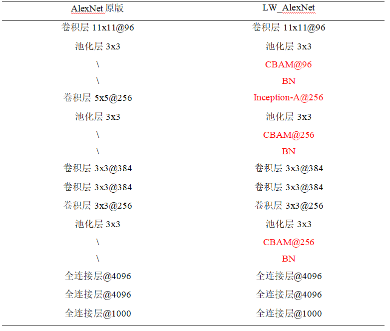

# 使用

## 训练

```
python train.py 
--dataset/-d        训练数据位置
--epochs            训练次数
--batch_size        批次大小
--lr                初始学习率
--dropout           随机设置激活单元为0的概率
--momentum          SGD优化器动量
--model             训练使用的模型
--num_classes       分类数量
--train_image_size  训练使用的图像数量，-1表示全部
--test_image_size   测试使用的图像数量，-1表示全部
--drop_list         是否丢弃多余的图
--shuffle           是否打乱图片
--save_csv          是否保存到csv文件
--random_seed       是否随机种子
--seed              指定种子的值
--learn_rate_decay  是否使用学习率衰减
--decay_rate        学习率衰减指数
--use_l1            使用L1范数
--use_l2            使用L2范数
--lambda1           L1范数比重
--lambda2           L2范数比重
--use_data_aug      是否使用数据增强
```

## 识别剪切板的图片

```python EvalByClipboard.py```

## 测试

```python test.py```

# 性能

## 数据增强

### 增强前


### 增强后


## 网络结构



# 比较


